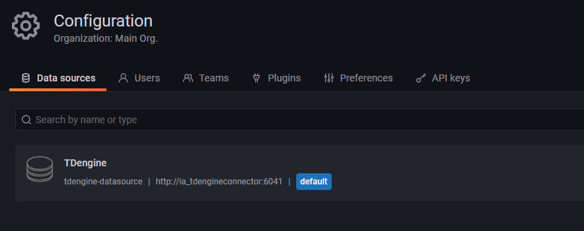

# EII Time Series Use Case Demo Leveraged by TDengine

## 1. Introduction

This manual will guide you how to run a simple time series demo using TDengine as time series data store. The start point is the time-series use case released along with EII v2.6.1 .

We will try to demo the following data flow.


There are three active data flows in about chart:
1. From MQTT Publisher to TDengine. 
2. From EMB Publisher to TDengine. 
3. From TDengine to EIS Message bus.

Besides, all data coming to TDengine can be visualized and monitored from Grafana. 

### 1.1. Convention

1. In this manual, for convenient we use `eiivm` to refer to the host installed EII.
2. We assume that the installing location is `/home/bo/eiiwork/IEdgeInsights`.
3. To precisely illustrate changes, we use `git diff` command at first, and then paste changed codes below.

### 2.2. Note

We added a new service named `TDengineConnector` to EII stack in this demo. However we have not followed the official steps introduced by page [adding-new-eii-service](https://open-edge-insights.github.io/pages/eiiConfig.html#adding-new-eii-service-so-it-gets-picked-up-by-builder) for development convenience.


## 2. Prepare

Setup pure EII environment using repo tool according to https://open-edge-insights.github.io/pages/running.html. Note that you should specify a branch name at initial phase as following.
```
repo init -u "https://github.com/open-edge-insights/eii-manifests.git" -b refs/tags/v2.6.1
```

Before building, set `DEV_MODE=true` in the env file `build/.env`. Then build default time series use case.
1. Run builder.py
    ```
    bo@vm1:~/eiiwork/IEdgeInsights/build$ python3 builder.py -f  usecases/time-series.yml
    ```
    After this step, the following three files are created under folder `build`.
    * docker-compose-build.yml
    * docker-compose.yml
    * docker-compose-push.yml
2. Provision
   ```
   bo@vm1:~/eiiwork/IEdgeInsights/build/provision$ sudo -E ./provision.sh ../docker-compose.yml --build
   ```
3. Build Images
   At last run `docker-compose -f docker-compose-build.yml build`.

When all preparing work is done, following images should be there.


To check the installing, you can run `docker-compose up -d`, and visit etcd ui at http://eiivm:7070.
```
bo@vm1:~/eiiwork/IEdgeInsights/build$ docker-compose up -d
bo@vm1:~/eiiwork/IEdgeInsights/build$ docker ps
CONTAINER ID   IMAGE                                         COMMAND                  CREATED              STATUS                                 PORTS                                                                                                                                                             NAMES
8389da53ceae   openedgeinsights/ia_etcd_ui:2.6.1             "python3 start_etcdk…"   About a minute ago   Up About a minute (health: starting)   0.0.0.0:7070-7071->7070-7071/tcp, :::7070-7071->7070-7071/tcp                                                                                                     ia_etcd_ui
0ff6b3e8cd13   ia_kapacitor:2.6.1                            "./classifier_startu…"   About a minute ago   Up About a minute (health: starting)   0.0.0.0:9092->9092/tcp, :::9092->9092/tcp                                                                                                                         ia_kapacitor
64d2fff8090c   openedgeinsights/ia_opcua_export:2.6.1        "./OpcuaExport/Opcua…"   About a minute ago   Up About a minute (health: starting)   0.0.0.0:65003->65003/tcp, :::65003->65003/tcp                                                                                                                     ia_opcua_export
e0259139ab57   openedgeinsights/ia_influxdbconnector:2.6.1   "./startup.sh"           About a minute ago   Up About a minute (health: starting)   0.0.0.0:8086->8086/tcp, :::8086->8086/tcp, 0.0.0.0:65030-65034->65030-65034/tcp, :::65030-65034->65030-65034/tcp, 0.0.0.0:65145->65145/tcp, :::65145->65145/tcp   ia_influxdbconnector
55e86e0e5f49   openedgeinsights/ia_grafana:2.6.1             "./Grafana/run.sh"       About a minute ago   Up About a minute (health: starting)   0.0.0.0:3000->3000/tcp, :::3000->3000/tcp                                                                                                                         ia_grafana
0f0e2216809d   openedgeinsights/ia_rest_export:2.6.1         "./RestDataExport"       About a minute ago   Up About a minute (health: starting)   0.0.0.0:8087->8087/tcp, :::8087->8087/tcp                                                                                                                         ia_rest_export
7fb5f7978928   ia_telegraf:2.6.1                             "python3 telegraf_st…"   About a minute ago   Up About a minute (health: starting)   0.0.0.0:65077->65077/tcp, :::65077->65077/tcp                                                                                                                     ia_telegraf
4b1290dc8199   openedgeinsights/ia_etcd:2.6.1                "./start_etcd.sh"        4 days ago           Up 4 days (healthy)                    0.0.0.0:2379->2379/tcp, :::2379->2379/tcp                                                                                                                         ia_etcd
bo@vm1:~/eiiwork/IEdgeInsights/build$ 
```

## 3. Modifies

### 3.1. MQTT Publisher

```git
bo@vm1:~/eiiwork/IEdgeInsights/tools/mqtt/publisher$ git diff publisher.py
diff --git a/mqtt/publisher/publisher.py b/mqtt/publisher/publisher.py
index c1d4c90..de10f18 100644
--- a/mqtt/publisher/publisher.py
+++ b/mqtt/publisher/publisher.py
@@ -243,7 +243,7 @@ def main():
             while True:
                 t_s = time.time()
                 for topic, value in updated_topics.items():
-                    msg = {'ts': t_s}
+                    msg = {'ts2': t_s}
                     print('-- Publishing message', t_s)
                     for d_topic in value:
                         msg.update({topic_data[d_topic]: random.uniform(
```
```python
243             while True:
244                 t_s = time.time()
245                 for topic, value in updated_topics.items():
246                     msg = {'ts2': t_s}
247                     print('-- Publishing message', t_s)
```

Change `ts` to `ts2`, since `ts` is the default column name of timestamp column when writing TDengine in schemaless way using InfluxDB line protocol.

Then rebuild image ia_mqtt_publisher.
```cmd
bo@vm1:~/eiiwork/IEdgeInsights/tools/mqtt/publisher$ set -a
bo@vm1:~/eiiwork/IEdgeInsights/tools/mqtt/publisher$ source ../../../build/.env
bo@vm1:~/eiiwork/IEdgeInsights/tools/mqtt/publisher$ set +a
bo@vm1:~/eiiwork/IEdgeInsights/tools/mqtt/publisher$ docker-compose build
```

**Note:** MQTT Publisher is a standalone component and is not governed by `build/docker-compose.yml`. So it can build separately, and all changes take effect immediately after rebuilding.

#### 3.1.2 How to check

1. start mqtt broker.
   ```cmd
   bo@vm1:~/eiiwork/IEdgeInsights/tools/mqtt$ ./broker.sh 1883
   ```
2. start mqtt publisher.
   ```cmd
   bo@vm1:~/eiiwork/IEdgeInsights/tools/mqtt/publisher$ docker-compose up -d
   ```
3. start mqtt subscriber.
   If one wish to see the messages going over MQTT, run the subscriber with the following command: `./subscriber.sh 1883`
   ```cmd
   bo@vm1:~/eiiwork/IEdgeInsights/tools/mqtt$ ./subscriber.sh 1883
   temperature/simulated/0 {"ts2": 1642388429.2801166, "temperature": 26.45200996946928}
   temperature/simulated/0 {"ts2": 1642388430.2873726, "temperature": 29.970841321999973}
   temperature/simulated/0 {"ts2": 1642388431.2956347, "temperature": 22.229535695515416}
   ```

### 3.2. Emb Publisher

We use Emb Publisher send electric voltage data in [OpenTSDB JSON format](http://opentsdb.net/docs/build/html/api_http/put.html).

#### 3.2.1. config.json

Increase iteration to 1000000, so that we can see simulate data continuously.

```cmd
bo@vm1:~/eiiwork/IEdgeInsights/tools/EmbPublisher$ git diff config.json
diff --git a/EmbPublisher/config.json b/EmbPublisher/config.json
index 9238050..d432f02 100644
--- a/EmbPublisher/config.json
+++ b/EmbPublisher/config.json
@@ -2,8 +2,8 @@
   "config": {
     "pub_name": "TestPub",
     "msg_file": "data1k.json",
-    "iteration": 10,
-    "interval": "5ms"
+    "iteration": 1000000,
+    "interval": "500ms"
   },
   "interfaces": {
     "Publishers": [
```

#### 3.2.2. data1k.json
`bo@vm1:~/eiiwork/IEdgeInsights/tools/EmbPublisher/datafiles$ vi data1k.json `
```json
{
        "metric": "electric_meter",
        "timestamp": 1,
        "value": 1,
        "tags": {
                "device_id": "BJ-12345",
                "metric_type": "voltage"
        }   
}
```

#### 3.2.3. pub_tool.go 
Change the value of simulate data in pub_tool.go.

```git
diff --git a/EmbPublisher/pub_tool.go b/EmbPublisher/pub_tool.go
index 5da6905..61711f2 100644
--- a/EmbPublisher/pub_tool.go
+++ b/EmbPublisher/pub_tool.go
@@ -29,6 +29,7 @@ import (
        "fmt"
        "sync"
        "time"
+       "math/rand"
 )
 
 var wg sync.WaitGroup
@@ -99,10 +100,10 @@ func main() {
                return
        }
 
-       for _, tpName := range topics {
-               wg.Add(1)
-               go publisher_function(config, tpName, msgData, intval, itr)
-       }
+       //for _, tpName := range topics {
+       wg.Add(1)
+       go publisher_function(config, topics[0], msgData, intval, itr)
+       //}
 
        wg.Wait()
 }
@@ -128,6 +129,7 @@ func publisher_function(config map[string]interface{}, topic string, msgData map
 
        for it := int64(0); it < itr; it++ {
                fmt.Printf("Topic Name:%v, Itr Num:%v\n", topic, it)
+               msgData["value"] = rand.Intn(300)       
                err = publisher.Publish(msgData)
                if err != nil {
                        fmt.Printf("-- Failed to publish message: %v\n", err)
```

#### 3.2.4. Add EmbPublisher and ZmqBroker to time-series.yml 
```cmd
bo@vm1:~/eiiwork/IEdgeInsights/build/usecases$ vi time-series.yml 
```
```yaml
# AppContexts is a list of the docker build context directory
# of the apps/services to be brought up
# 
# builder looks for docker-compose.yml & config.json
# in the below directories to include in the build
AppContexts:
- EtcdUI
- Telegraf
- InfluxDBConnector
- Kapacitor
- Grafana
- OpcuaExport
- RestDataExport
- ZmqBroker
- tools/EmbPublisher
```

**Note:** The changes will not take effect until we run builder.py and provision and build again.


### 3.3. Telegraf

#### 3.3.1. Telegraf.conf 

Add http output plugin.

```git
bo@vm1:~/eiiwork/IEdgeInsights/Telegraf/config/Telegraf$ git diff Telegraf_devmode.conf
diff --git a/config/Telegraf/Telegraf_devmode.conf b/config/Telegraf/Telegraf_devmode.conf
index b331c10..79f8e21 100644
--- a/config/Telegraf/Telegraf_devmode.conf
+++ b/config/Telegraf/Telegraf_devmode.conf
@@ -453,7 +453,15 @@
 
 
 # # A plugin that can transmit metrics over HTTP
-# [[outputs.http]]
+[[outputs.http]]
+  url = "http://$TDENGINE_SERVER:6041/influxdb/v1/write?db=eiidemo"
+  method = "POST"
+  timeout = "5s"
+  username = "root"
+  password = "taosdata"
+  data_format = "influx"
+  influx_max_line_bytes = 250
+
```

```toml
[[outputs.http]]
  url = "http://$TDENGINE_SERVER:6041/influxdb/v1/write?db=eiidemo"
  method = "POST"
  timeout = "5s" 
  username = "root" 
  password = "taosdata"
  data_format = "influx"
  influx_max_line_bytes = 250
```

#### 3.3.2. docker-compose.yml
```git
bo@vm1:~/eiiwork/IEdgeInsights/Telegraf$ git diff docker-compose.yml
diff --git a/docker-compose.yml b/docker-compose.yml
index 199ce7f..cfbe1c3 100644
--- a/docker-compose.yml
+++ b/docker-compose.yml
@@ -59,6 +59,7 @@ services:
       INFLUX_SERVER: 'ia_influxdbconnector'
       INFLUXDB_PORT: $INFLUXDB_PORT
       ETCD_PREFIX: ${ETCD_PREFIX}
+      TDENGINE_SERVER: 'ia_tdengineconnector'
     ports:
       - 65077:65077
     networks:
```  
```yaml
    environment:
      AppName: "Telegraf"
      CertType: "pem,zmq"
      DEV_MODE: ${DEV_MODE}
      no_proxy: "${ETCD_HOST},ia_influxdbconnector"
      NO_PROXY: "${ETCD_HOST},ia_influxdbconnector"
      ETCD_HOST: ${ETCD_HOST}
      ETCD_CLIENT_PORT: ${ETCD_CLIENT_PORT}
      MQTT_BROKER_HOST: 'ia_mqtt_broker'
      INFLUX_SERVER: 'ia_influxdbconnector'
      INFLUXDB_PORT: $INFLUXDB_PORT
      ETCD_PREFIX: ${ETCD_PREFIX}
      TDENGINE_SERVER: 'ia_tdengineconnector'
```
The last line above was added.
**Note:** The changes will not take effect until we run builder.py and provision and build again.

### 3.4. Grafana

In this step, we install TDengine Data Source to Grafana and make it as default data source just like below.



#### 3.4.1. datasource_sample.yml

```git
bo@vm1:~/eiiwork/IEdgeInsights/Grafana$ git diff datasource_sample.yml
diff --git a/datasource_sample.yml b/datasource_sample.yml
index 0e68fe7..e9c24df 100644
--- a/datasource_sample.yml
+++ b/datasource_sample.yml
@@ -10,15 +10,15 @@ apiVersion: 1
  # on what's available in the database
 datasources:
    # <string, required> name of the datasource. Required
- - name: InfluxDB
+ - name: TDengine 
    # <string, required> datasource type. Required
-   type: influxdb
+   type: tdengine-datasource 
    # <string, required> access mode. direct or proxy. Required
    access: proxy
    # <int> org id. will default to orgId 1 if not specified
    orgId: 1
    # <string> url
-   url: http://$INFLUX_SERVER:8086
+   url: http://$TDENGINE_SERVER:6041
    # <string> database user, if used
    user: ""
    # <string> database name, if used
```
```yaml
datasources:
   # <string, required> name of the datasource. Required
 - name: TDengine 
   # <string, required> datasource type. Required
   type: tdengine-datasource 
   # <string, required> access mode. direct or proxy. Required
   access: proxy
   # <int> org id. will default to orgId 1 if not specified
   orgId: 1
   # <string> url
   url: http://$TDENGINE_SERVER:6041
```

#### 3.4.2. modify_grafana_files.py
```git 
bo@vm1:~/eiiwork/IEdgeInsights/Grafana$ git diff modify_grafana_files.py
diff --git a/modify_grafana_files.py b/modify_grafana_files.py
index 442eff0..af560ac 100644
--- a/modify_grafana_files.py
+++ b/modify_grafana_files.py
@@ -239,15 +239,15 @@ def main():
     log = configure_logging(os.environ['PY_LOG_LEVEL'].upper(), __name__,
                             dev_mode)
     log.info("=============== STARTING grafana ===============")
-    db_config = read_config(app_cfg)
+    #db_config = read_config(app_cfg)
 
     if not dev_mode:
         log.info("generating prod mode config files for grafana")
-        generate_prod_datasource_file(db_config, eii_cert_path)
+        #generate_prod_datasource_file(db_config, eii_cert_path)
         generate_prod_ini_file()
     else:
         log.info("generating dev mode config files for grafana")
-        generate_dev_datasource_file(db_config)
+        #generate_dev_datasource_file(db_config)
         generate_dev_ini_file()
```
```python
229 def main():
230     """Main method for grafana
231     """
232     ctx = cfg.ConfigMgr()
233     app_cfg = ctx.get_app_config()
234     dev_mode = ctx.is_dev_mode()
235 
236     if not dev_mode:
237         eii_cert_path = get_grafana_config(app_cfg)
238 
239     log = configure_logging(os.environ['PY_LOG_LEVEL'].upper(), __name__,
240                             dev_mode)
241     log.info("=============== STARTING grafana ===============")
242     #db_config = read_config(app_cfg)
243 
244     if not dev_mode:
245         log.info("generating prod mode config files for grafana")
246         #generate_prod_datasource_file(db_config, eii_cert_path)
247         generate_prod_ini_file()
248     else:
249         log.info("generating dev mode config files for grafana")
250         #generate_dev_datasource_file(db_config)
251         generate_dev_ini_file()
252 
253     copy_config_files()
```

#### 3.4.3. run.sh 
```git
bo@vm1:~/eiiwork/IEdgeInsights/Grafana$ git diff run.sh
diff --git a/run.sh b/run.sh
index 2e34876..57fc5d3 100755
--- a/run.sh
+++ b/run.sh
@@ -32,14 +32,21 @@ export GF_PATHS_LOGS="/tmp/grafana/log/grafana"
 export GF_PATHS_PLUGINS="/tmp/grafana/lib/grafana/plugins"
 export GF_PATHS_PROVISIONING="/tmp/grafana/conf/provisioning"
 
+grafana-cli --pluginsDir "$GF_PATHS_PLUGINS" \
+           --pluginUrl https://github.com/taosdata/grafanaplugin/releases/download/v3.1.3/tdengine-datasource-3.1.3.zip \
+           plugins install tdengine-datasource;
+
 echo "Copying the grafana configurations to /tmp"
 cp -r /usr/share/grafana /tmp/
 
+echo "add TDengine datasource"
+cp ./Grafana/datasource_sample.yml /tmp/grafana/conf/provisioning/datasources/datasource.yml
+
 echo "Grafana enabled"
 python3 ./Grafana/modify_grafana_files.py
 
 if [ $? -eq 0 ]; then
-    echo "Grafana configuration files modified successfully"
+    #echo "Grafana configuration files modified successfully"
     exec grafana-server  \
     --homepath=/tmp/grafana/                  \
     --config=/tmp/grafana/grafana.ini         \
```
```sh
export GF_PATHS_DATA="/tmp/grafana/lib/grafana"
export GF_PATHS_LOGS="/tmp/grafana/log/grafana"
export GF_PATHS_PLUGINS="/tmp/grafana/lib/grafana/plugins"
export GF_PATHS_PROVISIONING="/tmp/grafana/conf/provisioning"

grafana-cli --pluginsDir "$GF_PATHS_PLUGINS" \
            --pluginUrl https://github.com/taosdata/grafanaplugin/releases/download/v3.1.3/tdengine-datasource-3.1.3.zip \
            plugins install tdengine-datasource;

echo "Copying the grafana configurations to /tmp"
cp -r /usr/share/grafana /tmp/

echo "add TDengine datasource"
cp ./Grafana/datasource_sample.yml /tmp/grafana/conf/provisioning/datasources/datasource.yml

echo "Grafana enabled"
python3 ./Grafana/modify_grafana_files.py

if [ $? -eq 0 ]; then
    #echo "Grafana configuration files modified successfully"
    exec grafana-server  \
    --homepath=/tmp/grafana/                  \   
    --config=/tmp/grafana/grafana.ini         \   
    cfg:default.paths.data="$GRAFANA_DATA_PATH"   \   
    cfg:default.paths.logs="$GRAFANA_LOGS_PATH"   \
    cfg:default.paths.plugins="$GRAFANA_PLUGINS_PATH"
else
    echo "Failed to modify Grafana configuration files. Exiting!!!"
fi
```

#### 3.4.4. docker-compose.yml
In this step, we add two environment variables to docker-compose.yml.
We add `GF_PLUGINS_ALLOW_LOADING_UNSIGNED_PLUGINS` since tdengine-datasource was not signed.
```git
bo@vm1:~/eiiwork/IEdgeInsights/Grafana$ git diff docker-compose.yml
diff --git a/docker-compose.yml b/docker-compose.yml
index 70b3560..6fa4cf8 100644
--- a/docker-compose.yml
+++ b/docker-compose.yml
@@ -55,6 +55,8 @@ services:
       ETCD_PREFIX: ${ETCD_PREFIX}
       INFLUX_SERVER: 'ia_influxdbconnector'
       GRAFANA_SERVER: '0.0.0.0'
+      TDENGINE_SERVER: 'ia_tdengineconnector'
+      GF_PLUGINS_ALLOW_LOADING_UNSIGNED_PLUGINS: tdengine-datasource
     networks:
```
```yml 
    environment:
      AppName: "Grafana"
      CertType: "pem"
      DEV_MODE: ${DEV_MODE}
      no_proxy: "${ETCD_HOST},ia_influxdbconnector"
      NO_PROXY: "${ETCD_HOST},ia_influxdbconnector"
      ETCD_HOST: ${ETCD_HOST}
      ETCD_PREFIX: ${ETCD_PREFIX}
      INFLUX_SERVER: 'ia_influxdbconnector'
      GRAFANA_SERVER: '0.0.0.0'
      TDENGINE_SERVER: 'ia_tdengineconnector'
      GF_PLUGINS_ALLOW_LOADING_UNSIGNED_PLUGINS: tdengine-datasource
```
**Note:** The changes will not take effect until we run builder.py and provision and build again.

### 3.5. Generate Consolidated docker-compose.yml
```sh
bo@vm1:~/eiiwork/IEdgeInsights/build$  python3 builder.py -f usecases/time-series.yml
```
Check that all changes made to component specific `docker-compose.yml` were collected to `build/docker-compose.yml`
```bash
bo@vm1:~/eiiwork/IEdgeInsights/build$ vi docker-compose.yml
```
```yaml
#...
  ia_grafana:
    image: ${DOCKER_REGISTRY}openedgeinsights/ia_grafana:${EII_VERSION}
    container_name: ia_grafana
    hostname: ia_grafana
    read_only: true
    restart: unless-stopped
    ipc: "none"
    security_opt:
    - no-new-privileges
    healthcheck:
      test: ["CMD-SHELL", "exit", "0"]
      interval: 5m
    environment:
      AppName: "Grafana"
      CertType: "pem"
      DEV_MODE: ${DEV_MODE}
      no_proxy: "${ETCD_HOST},ia_influxdbconnector"
      NO_PROXY: "${ETCD_HOST},ia_influxdbconnector"
      ETCD_HOST: ${ETCD_HOST}
      ETCD_PREFIX: ${ETCD_PREFIX}
      INFLUX_SERVER: 'ia_influxdbconnector'
      GRAFANA_SERVER: '0.0.0.0'
      TDENGINE_SERVER: 'ia_tdengineconnector'
      GF_PLUGINS_ALLOW_LOADING_UNSIGNED_PLUGINS: tdengine-datasource
#...
```

### 3.6. Build and Integrate `TDengineConnector`
#### 3.6.1 Clone
```bash
bo@vm1:~$ git clone git@github.com:taosdata/eii-tdengine-connector.git
bo@vm1:~/eii-tdengine-connector$ ls
build.sh  Dockerfile  driver-go-2.0.0  README.md  startup.sh 
TDengineConnector.go  TDengine-server-2.3.5.0-beta-Linux-x64.deb
zmq_sub.py
```
#### 3.6.2. build
```bash
bo@vm1:~/eii-tdengine-connector$ cp ../eiiwork/IEdgeInsights/build/.env  ./
bo@vm1:~/eii-tdengine-connector$ ./build.sh 
bo@vm1:~/eii-tdengine-connector$ docker images | grep ia_tdengineconnector
taos/ia_tdengineconnector               0.0.1          3b9a02812d61   About a minute ago   1.37GB
```

#### 3.6.3. docker-compose.yml
```bash
bo@vm1:~/eiiwork/IEdgeInsights/build$ vi docker-compose.yml
```
Append ia_tdengineconnector to services section.
```yaml
  ia_tdengineconnector:
    read_only: true
    ipc: "none"
    image: taos/ia_tdengineconnector:0.0.1 
    container_name: ia_tdengineconnector
    hostname: ia_tdengineconnector
    restart: unless-stopped
    environment:
      AppName: "TDengineConnector"
      CertType: "zmq,pem"
      DEV_MODE: ${DEV_MODE}
      PROFILING_MODE: ${PROFILING_MODE}
      no_proxy: ${ETCD_HOST}
      NO_PROXY: ${ETCD_HOST}
      ETCD_HOST: ${ETCD_HOST}
      ETCD_CLIENT_PORT: ${ETCD_CLIENT_PORT}
      ETCD_PREFIX: ${ETCD_PREFIX}
    ports:
    - 65040:65040
    networks:
    - eii
    volumes:
    - "vol_tdengine_data:/var/lib/taos"
    - "vol_tdengine_log:/var/log/taos"
    - "vol_temp_tdengine:/tmp"
```
Append below volumes to volumes section.
```yaml
  vol_tdengine_data:
    driver: local
    driver_opts:
      type: local
      o: bind
      device: ${EII_INSTALL_PATH}/taos/data

  vol_tdengine_log:
    driver: local
    driver_opts:
      type: local
      o: bind
      device: ${EII_INSTALL_PATH}/taos/log
  vol_temp_tdengine:
    driver: local
    driver_opts:
      type: tmpfs
      device: tmpfs
```
Create folder for taos data and taos log on host machine.
```bash
bo@vm1:~/eiiwork/IEdgeInsights/build$ sudo mkdir -p /opt/intel/eii/taos/{data,log}
bo@vm1:/opt/intel/eii$ sudo chown -R eiiuser /opt/intel/eii/taos
bo@vm1:/opt/intel/eii$ sudo chgrp -R eiiuser /opt/intel/eii/taos
```

#### 3.6.4. ETCD Config
```bash
bo@vm1:~/eiiwork/IEdgeInsights/build/provision/config$ vi eii_config.json 
```
```json
    "/TDengineConnector/config": {
        "tdengine": {
                 "user": "root",
                "password": "taosdata"
        }
    },
    "/TDengineConnector/interfaces": {
            "Publishers": [
                {
                    "AllowedClients": [
                        "*"
                    ],
                    "EndPoint": "0.0.0.0:65040",
                    "Name": "PointData",
                    "Topics": [
                        "eiidemo.point_data"
                    ],
                    "Type": "zmq_tcp"
                }
            ],
            "Subscribers": [
                {
                    "Name": "TestSub",
                    "Type": "zmq_tcp",
                    "EndPoint": "ia_zmq_broker:60515",
                    "Topics": [
                        "topic-pfx1"
                    ],
                    "PublisherAppName": "*",
                    "AllowedClients": [
                        "*"
                    ]
                }
            ]
    }
```

### 3.7. Provision and Build
#### 3.7.1. Provision
```bash
bo@vm1:~/eiiwork/IEdgeInsights/build/provision$ sudo -E ./provision.sh ../docker-compose.yml --build
```
#### 3.7.2. Build 
```bash
bo@vm1:~/eiiwork/IEdgeInsights/build$ docker-compose -f docker-compose-build.yml build
```

**Note**
> Step 3.7 must follow step 3.6. The order is very important, because that in provision step, only AppNames appeared in `build/docker-compose.yml` will be included in etcd configurations like below:
> 
> 
(http://eiivm:7070/etcdkeeper/)

> The building process will take long time, you can comment out some images that do not need to rebuild.

## 4. Startup and Test

### 4.1. Start MQTT Broker 
```bash
bo@vm1:~/eiiwork/IEdgeInsights/tools/mqtt$ ./broker.sh 1883
9a0eef5c5f50cc15e96457386b5a1cbf8574f1e85684100f614d3d34d348c0b4
```
Now you should see two active containers.
```bash
bo@vm1:~/eiiwork/IEdgeInsights/tools/mqtt$ docker ps
CONTAINER ID   IMAGE                            COMMAND                 CREATED          STATUS                    PORTS                                       NAMES
9a0eef5c5f50   trafex/alpine-mosquitto:1.6.0    "/usr/sbin/mosquitto"   25 seconds ago   Up 24 seconds             0.0.0.0:1883->1883/tcp, :::1883->1883/tcp   ia_mqtt_broker
8c24a200cf4f   openedgeinsights/ia_etcd:2.6.1   "./start_etcd.sh"       17 minutes ago   Up 17 minutes (healthy)   0.0.0.0:2379->2379/tcp, :::2379->2379/tcp   ia_etcd
``` 
`ia_etcd` was started automatically in provision step.

### 4.2. Start MQTT Publisher
```bash
bo@vm1:~/eiiwork/IEdgeInsights/tools/mqtt$ cd publisher/
bo@vm1:~/eiiwork/IEdgeInsights/tools/mqtt/publisher$ set -a
bo@vm1:~/eiiwork/IEdgeInsights/tools/mqtt/publisher$ source ../../../build/.env
bo@vm1:~/eiiwork/IEdgeInsights/tools/mqtt/publisher$ set +a
bo@vm1:~/eiiwork/IEdgeInsights/tools/mqtt/publisher$ docker-compose up -d
WARNING: Found orphan containers (ia_etcd_provision, ia_etcd) for this project. If you removed or renamed this service in your compose file, you can run this command with the --remove-orphans flag to clean it up.
Creating ia_mqtt_publisher ... done
```
Make sure that there is data sending to mqtt broker by subscribe to mqtt broker.
```bash
bo@vm1:~/eiiwork/IEdgeInsights/tools/mqtt$ ./subscriber.sh 1883
temperature/simulated/0 {"ts2": 1642480711.970991, "temperature": 15.962277493169639}
```

### 4.3. Start Other Services
```bash
bo@vm1:~/eiiwork/IEdgeInsights/build$ docker-compose up -d 
WARNING: The no_proxy variable is not set. Defaulting to a blank string.
WARNING: Found orphan containers (ia_etcd_provision, ia_etcd, ia_mqtt_publisher) for this project. If you removed or renamed this service in your compose file, you can run this command with the --remove-orphans flag to clean it up.
Creating ia_etcd_ui           ... done
Creating ia_influxdbconnector ... done
Creating ia_tdengineconnector ... done
Creating ia_rest_export       ... done
Creating ia_grafana           ... done
Creating ia_zmq_broker        ... done
Creating ia_telegraf          ... done
Creating emb_publisher        ... done
Creating ia_opcua_export      ... done
```
(Note that there is no ia_kapacitor since I removed it from docker-compose.yml. We will not need it in this demo.)

### 4.4. Check the Log of Grafana 
Make sure that tdengine-datasource is installed successfully.
```bash
bo@vm1:~$ docker logs -f ia_grafana | head -20
✔ Downloaded tdengine-datasource v3.1.3 zip successfully

Please restart Grafana after installing plugins. Refer to Grafana documentation for instructions if necessary.

Copying the grafana configurations to /tmp
add TDengine datasource
Grafana enabled
2022-01-18 04:43:27,267 : INFO  : {} : root : [modify_grafana_files.py] :main : in line : [241] : =============== STARTING grafana ===============
2022-01-18 04:43:27,267 : INFO  : {} : root : [modify_grafana_files.py] :main : in line : [249] : generating dev mode config files for grafana
t=2022-01-18T04:43:27+0000 lvl=info msg="Starting Grafana" logger=server version=8.1.5 commit=c725a4259a branch=HEAD compiled=2021-09-21T08:54:08+0000
```

### 4.5. Inspect the Log of Telegraf 
```bash
bo@vm1:~/eiiwork/IEdgeInsights/build$ docker logs -f ia_telegraf 
Published message: map[Name:point_data temperature:12.033427094673819 ts2:1.6424809638934631e+09]
Published message: map[Name:point_data temperature:29.3278373751361 ts2:1.6424809649053257e+09]
Published message: map[Name:point_data temperature:14.340618818353004 ts2:1.642480965907678e+09]
Published message: map[Name:point_data temperature:18.12039513197303 ts2:1.642480966918946e+09]
Published message: map[Name:point_data temperature:23.62671573312792 ts2:1.642480967941778e+09]
Published message: map[Name:point_data temperature:15.043041320701292 ts2:1.6424809689446454e+09]
Published message: map[Name:point_data temperature:23.9147298163939 ts2:1.642480969948069e+09]
Published message: map[Name:point_data temperature:22.36534608483997 ts2:1.6424809709592195e+09]
Published message: map[Name:point_data temperature:10.937451359340658 ts2:1.6424809719646316e+09]
```
### 4.6. Check the Log of Emb Publisher
Make sure that EmbPublisher works well.
```bash
bo@vm1:~$ docker logs -f emb_publisher
[Tue Jan 18 04:42:39 2022]  WARN:get_config_value:204: JSON does not contain key: zmq_recv_hwm
[Tue Jan 18 04:42:39 2022]  WARN:zap_initialize:205: Running ZeroMQ TCP sockets without ZAP authentication
-- message size is: 107
-- Initializing message bus context:map[type:zmq_tcp zmq_tcp_publish:map[brokered:true host:ia_zmq_broker port:60514]]
-- Creating publisher for topic topic-pfx1
[Tue Jan 18 04:42:39 2022]  WARN:init_curve_client_socket:2088: ZeroMQ TCP client socket running in insecure mode
Topic Name:topic-pfx1, Itr Num:0
Topic Name:topic-pfx1, Itr Num:1
Topic Name:topic-pfx1, Itr Num:2
Topic Name:topic-pfx1, Itr Num:3
......
```

### 4.7. Visit ETCD UI 
Make sure `/TDengineConnector/config` is added and correctly configured.


### 4.8. Subscribe to ZMQ Broker
In this step, we subscribe to ZMQ Broker，to see weather the data send by EmbPublisher are in expected format.
```bash
bo@vm1:~/eii-tdengine-connector$ vi zmq_sub.py 
```
This is a simple python script that can print the data published by any ZMQ Publisher.
```python
"""
subscribe data and print to stdout
usage:
python3 zmq_sub.py <port>
"""
import zmq 
import sys 

ctx = zmq.Context()
sock = ctx.socket(zmq.SUB)
sock.subscribe(b'')
print("connect to port", sys.argv[1])
sock.connect("tcp://localhost:" + sys.argv[1])
while True:
    data = sock.recv_multipart()
    print(data)
```
```bash
bo@vm1:~/eii-tdengine-connector$ python3 zmq_sub.py 60515
connect to port 60515
[b'topic-pfx1\x00', b'\x00', b'\x01', b'{"tags":{"metric_type":"voltage","device_id":"BJ-12345"},"value":178,"metric":"electric_meter","timestamp":1}']
[b'topic-pfx1\x00', b'\x00', b'\x01', b'{"value":175,"tags":{"metric_type":"voltage","device_id":"BJ-12345"},"metric":"electric_meter","timestamp":1}']
[b'topic-pfx1\x00', b'\x00', b'\x01', b'{"tags":{"metric_type":"voltage","device_id":"BJ-12345"},"value":253,"metric":"electric_meter","timestamp":1}']
[b'topic-pfx1\x00', b'\x00', b'\x01', b'{"value":162,"tags":{"metric_type":"voltage","device_id":"BJ-12345"},"metric":"electric_meter","timestamp":1}']
[b'topic-pfx1\x00', b'\x00', b'\x01', b'{"tags":{"metric_type":"voltage","device_id":"BJ-12345"},"value":26,"metric":"electric_meter","timestamp":1}']
[b'topic-pfx1\x00', b'\x00', b'\x01', b'{"tags":{"metric_type":"voltage","device_id":"BJ-12345"},"value":118,"metric":"electric_meter","timestamp":1}']
```
**Note:**
> The timestamp is a constant value 1 above. This is because when I try to send a value with int64 type, EIIMessageBus will panic:
> panic: interface conversion: interface {} is int64, not int
>
>goroutine 9 [running]:
EIIMessageBus/internal/pkg/msgbus.goToMsgEnvElemBody(0x4fe2a0, 0xc0000fa040, 0xeb0790, 0x0, 0x0)
/go/src/EIIMessageBus/internal/pkg/msgbus/msg_envelope.go:175 +0xa5a
EIIMessageBus/internal/pkg/msgbus.addMapToMsgEnvelope(0xeaea80, 0xc00007c5d0, 0xc00005a0c0, 0xc0000f8000)
/go/src/EIIMessageBus/internal/pkg/msgbus/msg_envelope.go:250 +0xbe

So, as a workaround, I modified the timestamp in `TDengineConnector.go` before inserting data to TDengine.

### 4.9. Inspect TDengineConnector Status
Come into container ia_tdengineconnector and make sure that there are three process living:
1. taosd
2. taosAdapter
3. TDengineConnector

```bash
bo@vm1:~/eiiwork/IEdgeInsights/build$ docker exec -it ia_tdengineconnector bash
root@ia_tdengineconnector:~# ps xf
  PID TTY      STAT   TIME COMMAND
  119 pts/0    Ss     0:00 bash
  128 pts/0    R+     0:00  \_ ps xf
    1 ?        Ss     0:00 /bin/bash ./startup.sh
    7 ?        Sl     1:36 /usr/bin/taosadapter
    8 ?        Sl     1:10 taosd
    9 ?        Sl     2:31 ./TDengineConnector
```

### 4.10. Inspect the Log of TDengineConnector

```bash
bo@vm1:~/eiiwork/IEdgeInsights/build$ docker logs --tail 20  ia_tdengineconnector 
" sessionID=10824 model=web
I0118 05:43:20.868346       9 TDengineConnector.go:113] Published message: map[data:ts=1642484600187 ts2=1.6424846001837196e+09 temperature=16.556916972564437 host=ia_telegraf topic=temperature/simulated/0 ]
I0118 05:43:21.243358       9 TDengineConnector.go:156] Subscribe data received from topic: topic-pfx1  Data: map[metric:electric_meter tags:map[device_id:BJ-12345 metric_type:voltage] timestamp:1642484601243 value:41]
" model=web sessionID=10825
" model=web sessionID=10826
I0118 05:43:21.746452       9 TDengineConnector.go:156] Subscribe data received from topic: topic-pfx1  Data: map[metric:electric_meter tags:map[device_id:BJ-12345 metric_type:voltage] timestamp:1642484601746 value:179]
" sessionID=10827 model=web
I0118 05:43:21.886897       9 TDengineConnector.go:113] Published message: map[data:ts=1642484601190 ts2=1.6424846011881897e+09 temperature=19.53831031415785 host=ia_telegraf topic=temperature/simulated/0 ]
" model=web sessionID=10828
I0118 05:43:22.248801       9 TDengineConnector.go:156] Subscribe data received from topic: topic-pfx1  Data: map[metric:electric_meter tags:map[device_id:BJ-12345 metric_type:voltage] timestamp:1642484602248 value:13]
" model=web sessionID=10829
I0118 05:43:22.760496       9 TDengineConnector.go:156] Subscribe data received from topic: topic-pfx1  Data: map[metric:electric_meter tags:map[device_id:BJ-12345 metric_type:voltage] timestamp:1642484602760 value:263]
" model=web sessionID=10830
I0118 05:43:22.901057       9 TDengineConnector.go:113] Published message: map[data:ts=1642484602197 ts2=1.6424846021921108e+09 temperature=12.426536489772692 host=ia_telegraf topic=temperature/simulated/0 ]
```

### 4.11. Inspect the Log of taosAdapter
```bash
bo@vm1:/opt/intel/eii/taos/log$ tail -f taosadapter_2022_01_18_00_00.log 
01/18 05:19:03.305210 00000007 TAOS_ADAPTER info "| 204 |    5.721986ms |     172.18.0.11 | POST | /influxdb/v1/write?db=eiidemo 
" model=web sessionID=6468
01/18 05:19:03.424156 00000007 TAOS_ADAPTER info "| 200 |   18.358985ms |       127.0.0.1 | POST | /opentsdb/v1/put/json/eiidemo 
" model=web sessionID=6469
01/18 05:19:03.910768 00000007 TAOS_ADAPTER info "| 200 |    3.336138ms |       127.0.0.1 | POST | /opentsdb/v1/put/json/eiidemo 
" model=web sessionID=6470
01/18 05:19:04.324066 00000007 TAOS_ADAPTER info "| 204 |    4.952752ms |     172.18.0.11 | POST | /influxdb/v1/write?db=eiidemo 
" model=web sessionID=6471
01/18 05:19:04.415486 00000007 TAOS_ADAPTER info "| 200 |     6.31516ms |       127.0.0.1 | POST | /opentsdb/v1/put/json/eiidemo 
" model=web sessionID=6472
01/18 05:19:04.935870 00000007 TAOS_ADAPTER info "| 200 |   14.473523ms |       127.0.0.1 | POST | /opentsdb/v1/put/json/eiidemo 
" model=web sessionID=6473
01/18 05:19:05.378189 00000007 TAOS_ADAPTER info "| 204 |   52.170223ms |     172.18.0.11 | POST | /influxdb/v1/write?db=eiidemo
```
We see two URL patterns in above log: 
* `/opentsdb/v1/put/json/eiidemo`: This request is sent from Telegraf 
* `/influxdb/v1/write?db=eiidemo `: This request is sent from TDengineConnector

### 4.12. Monitor Data via Grafana 
Run Query: `show databases`


Run Query: `show eiidemo.stables`


Run Query: `describe eiidemo.point_data`


Run Query: `select ts,  temperature from eiidemo.point_data`


Run Query: `select * from eiidemo.electric_meter limit 10`


Run Query: `select ts, value from eiidemo.electric_meter where device_id = 'BJ-12345'`


## 5. Improvement 
Make  `TDengineConnector` a standard component in EII stack.

1. Move `TDengineConnector` to `~/eiiwork/IEdgeInsights`
2. Add  `docker-compose.yml` to `TDengineConnector`
3. Add `TDengineConnector` to `usecase/time-series.yml`
4. Push `TDengineConnector` docker image to registry.

Then the build process will be easier and this demo will available to all people.

Refine `TDengineConnector` image.
1. Make TDengineConnector.go more robust.
2. Improvement TDengineConnector.go so that it can support any number of topics.
3. Reduce the size of the image.

## 6. References

- [Install EII](https://open-edge-insights.github.io/pages/running.html)
- [EmbPublisher](https://open-edge-insights.github.io/pages/tools.html#how-to-integrate-this-tool-with-video-timeseries-use-case)
- [adding-new-eii-service](https://open-edge-insights.github.io/pages/eiiConfig.html#adding-new-eii-service-so-it-gets-picked-up-by-builder)