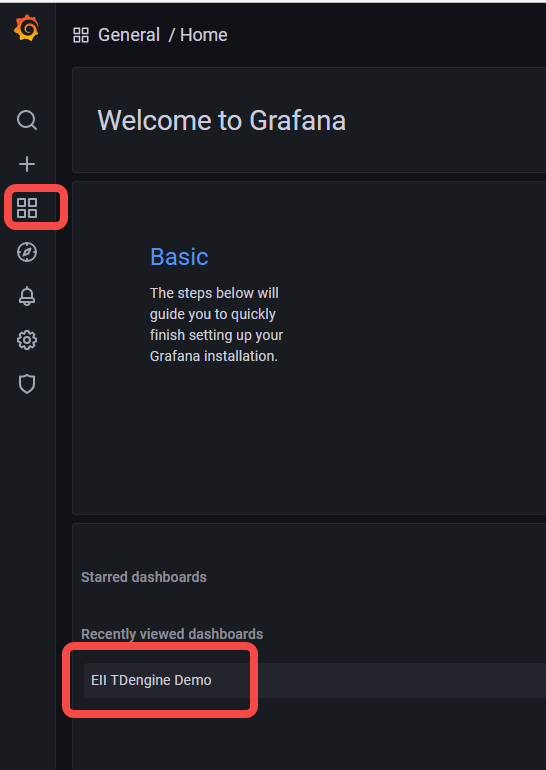
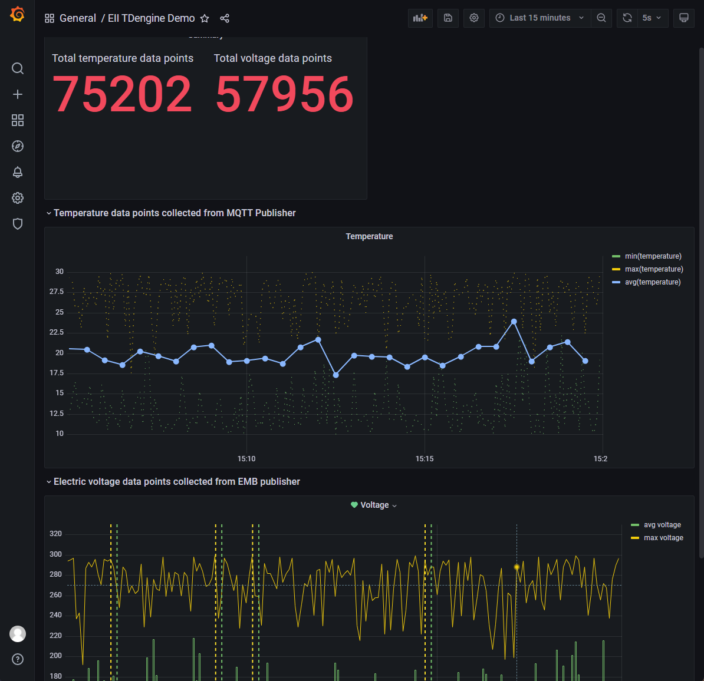

# Add Default Dashboard

You need only replace old `dashboard.json` with `tdengine-dashboard.json`.

## steps

1. copy tdengine-dashboard.json to Grafana directory.
```bash
cp tdengine-dashboard.json ~/eiiwork/IEdgeInsights/Grafana/
```

2. backup old dashboard.json

```bash
mv dashboard.json dashboard.json.bak
```

3. rename tdengine-dashboard.json
```bash
mv tdengine-dashboard.json dashboard.json
```

4. rebuild ia_grafana
```
cd ../build
docker-compose build -f docker-compose-build.yml ia_grafana
```

5. restart all
```
docker-compose down
docker-compose up -d
```

## check


click `EII TDengine Demo`.

